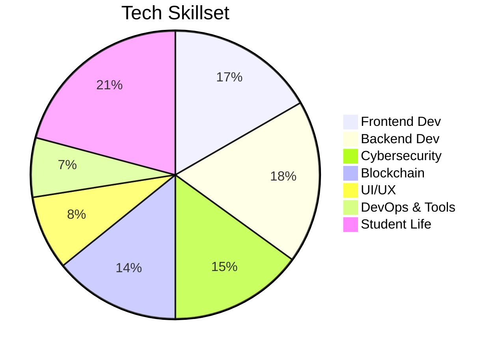

<!-- Hacker Banner -->
<p align="center">
  
</p>

<p align="center">
  
  
  
</p>

---

```
$ whoami
Boobesh Kumar
[ Engineering Student | Full Stack Dev | Blockchain Builder | Cyber Warrior ]
```

---

### 🥷 Skillset Visualization



---

### 🚩 Featured Projects

| Project        | Preview | Description |
| -------------- | ------- | ----------- |
| 🧑‍💬 **Let's Text** |  | Real-time chat app using React, Node, Socket.IO, MongoDB |
| 🛠️ **Vialan** |  | Toolbox for file transfer, device scan, chat, WebRTC meetings |
| 👩‍⚕️ **FemmeCare** |  | AI-powered women's health tracker with ML predictions |

---

### 💡 About Me

- 🎓 Engineering Student passionate about tech and open source
- 🛡️ Building secure & scalable full-stack apps
- 🦾 Exploring SOC, SIEMs, threat hunting, and bug bounty
- 💻 Active OSS contributor via GSSoC 2024!

---

### 📬 Connect with Me

<p align="center">
  <a href="https://www.linkedin.com/in/boobeshkumar56"></a>
  <a href="mailto:boobeshkumar56@gmail.com"></a>
</p>

---

### 🧩 Fun Fact

`I automate my ideas into products and secure them before anyone else breaks in... 👨‍💻🔐`

---

<!-- Hacker terminal style footer -->
<p align="center">
  
</p>
